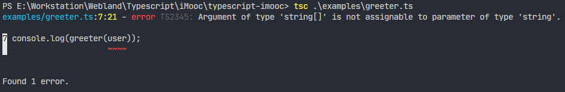

# 安装 TypeScript

控制台运行：

```sh
$ npm install -g typescript
$ tsc -v
Version 3.9.5
```

# 编写第一个 TypeScript 程序

- 类型注解
- 接口
- 类

*examples\greeter.ts*

```typescript
function greeter(person) {
    return "Hello " + person;
}
var user = 'Darwin';
console.log(greeter(user));

```

控制台编译 ts 文件：

```sh
$ tsc .\examples\greeter.ts
```

生成 js 文件：*examples\greeter.js*

```js
function greeter(person) {
    return "Hello " + person;
}
var user = 'Darwin';
console.log(greeter(user));

```

然后，在控制台运行：

```sh
$ node .\examples\greeter.js
Hello Darwin
```

## 类型注解

*examples\greeter.ts*

```typescript
function greeter(person: string) {
  return `Hello ${person}`
}

const user = 'Darwin'

console.log(greeter(user));

```

编译后：*examples\greeter.js*

```js
function greeter(person) {
    return "Hello " + person;
}
var user = 'Darwin';
console.log(greeter(user));

```

**传递与类型不符的参数**

*examples\greeter.ts*

```typescript
function greeter(person: string) {
  return `Hello ${person}`
}

const user = ['Darwin']

console.log(greeter(user));


```

 

编译会发生错误：



但是文件会生成：*examples\greeter.js*

```js
function greeter(person) {
    return "Hello " + person;
}
var user = ['Darwin'];
console.log(greeter(user));

```

## 接口

*examples\greeter.ts*

```typescript
interface Person {
  firstName: string
  lastName: string
}

function greeter(person: Person) {
  console.log(`Hello ${person.firstName} ${person.lastName}`)
}

const user = {
  firstName: 'Charles',
  lastName: 'Darwin'
}

greeter(user)
```

编译后：

*examples\greeter.js*

```js
function greeter(person) {
    console.log("Hello " + person.firstName + " " + person.lastName);
}
var user = {
    firstName: 'Charles',
    lastName: 'Darwin'
};
greeter(user);
```

## 类

*examples\greeter.ts*

```typescript
class User {
  fullName: string
  firstName: string
  lastName: string

  constructor(firstName: string, lastName: string) {
    this.firstName = firstName
    this.lastName = lastName
    this.fullName = firstName + ' ' + lastName
  }
}

function greeter(user: User) {
  console.log(`Hello ${user.fullName}`)
}

const user = new User('Charles', 'Darwin')
greeter(user)
```

编译后：*examples\greeter.js*

```js
var User = /** @class */ (function () {
    function User(firstName, lastName) {
        this.firstName = firstName;
        this.lastName = lastName;
        this.fullName = firstName + ' ' + lastName;
    }
    return User;
}());
function greeter(user) {
    console.log("Hello " + user.fullName);
}
var user = new User('Charles', 'Darwin');
greeter(user);
```

